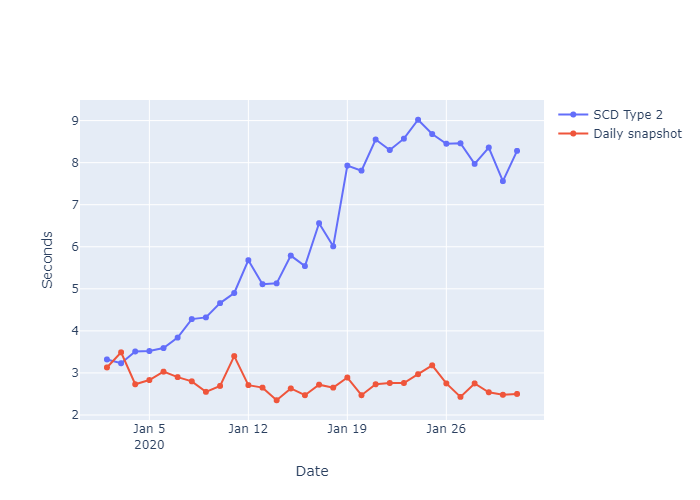

Data modeling is crucial because it provides a structured framework for organising and interpreting data. Slowly Changing Dimension (SCD) Tyoe 2 is a popular method in data warehousing for managing and tracaking historical data changes.

It is not possible to solve every problems with the same data modeling approach in the most efficient manner. It is better to model the data that fits its characteristics, the business requirement and the tech stack in each case.

Given the rise of cloud data warehouse and the storage has become dirt cheap, abandoning SCD and taking daily snapshot for dimension tables could be more effective under certain scenarios.

We will create two `customer` dimension tables for the same dataset, one using SCD Type 2 and the other using daily snapshots, and then compare benchmarks for both approaches.

## Assumption
Daily snapshot of the transaction database table is exported to the data lake and available for OLAP workload.
## Set Up
- Snowflake is used as the compute engine.
- An extra small warehouse in Snowflake is used to execute the query.
- All queries are executed sequentially.
- dbt is used to managed the data transformation logic.

### Synthetic Data Generation

The dataset we will the following characteristics:
- Each customer can only have 1 entry per date.
- `customer_address` is the only attribute that can change.
- `updated_date` indicates the last modified date of the record.

```sql
CREATE DATABASE IF NOT EXISTS practice;

CREATE SCHEMA IF NOT EXISTS  practice.dimensional_models;

SET customer_sample_size = 1000000;

CREATE
OR REPLACE TEMPORARY TABLE customer_change AS WITH cte AS (
    SELECT
        UNIFORM(1, $customer_sample_size / 2, RANDOM(1)) :: INT AS customer_id,
        MD5(customer_id) AS customer_name,
        RANDSTR(
            UNIFORM(3, 20, RANDOM(4)),
            UNIFORM(5, $customer_sample_size * 4, RANDOM(6))
        ) AS customer_address,
        DATEADD(
            'day',
            FLOOR(UNIFORM(0, 30, RANDOM(7))),
            '2020-01-01'
        ) AS updated_date,
    FROM
        TABLE(GENERATOR(rowcount => $customer_sample_size)) qualify ROW_NUMBER() over (
            PARTITION BY customer_id,
            updated_date
            ORDER BY
                updated_date ASC
        ) = 1 -- one entry per customer per DAY
),
with_row_num AS (
    SELECT
        customer_id,
        customer_name,
        customer_address,
        first_value(updated_date) over(
            PARTITION by customer_id
            ORDER BY
                updated_date ASC
        ) AS registration_date,
        updated_date,
        ROW_NUMBER() over (
            PARTITION BY customer_id
            ORDER BY
                updated_date ASC
        ) AS row_num
    FROM
        cte
)
SELECT
    w1.customer_id,
    w1.customer_name,
    w1.customer_address,
    w1.registration_date,
    w1.updated_date
FROM
    with_row_num w1
    LEFT JOIN with_row_num w2 ON w1.customer_id = w2.customer_id
    AND w1.row_num = w2.row_num -1
WHERE
    w1.customer_address != w2.customer_address
    OR w2.customer_id IS NULL;

CREATE
OR REPLACE TABLE customer_stage AS WITH record_date AS (
    SELECT
        '2019-12-31' :: DATE + n AS record_date
    FROM
        (
            SELECT
                ROW_NUMBER() over(
                    ORDER BY
                        0
                ) n
            FROM
                TABLE(GENERATOR(rowcount => 31))
        )
)
SELECT
    *
FROM
    customer_change C
    JOIN record_date d ON C.updated_date <= d.record_date qualify ROW_NUMBER() over (
        PARTITION BY d.record_date,
        C.customer_id
        ORDER BY
            updated_date DESC
    ) = 1;
```

# Comparison
## Development
**Daily Dimension Snapshot**
```sql
{{
    config(
        materialized='incremental',
        unique_key=['customer_id', 'record_date']
    )
}}

select 
    {{ dbt_utils.generate_surrogate_key(['customer_id', 'record_date']) }} as customer_key,
    *
from {{ source('DIMENSIONAL_MODELS', 'CUSTOMER_STAGE')}}
where record_date >= '{{ var('start_date') }}'
    and record_date < '{{ var('end_date') }}'
```
**SCD Type 2**
```sql


{{
    config(
      target_database='practice',
      target_schema='dimensional_models',
      unique_key='customer_id',
      strategy='timestamp',
      updated_at='updated_date',
    )
}}

select
    {{ dbt_utils.generate_surrogate_key(['customer_id', 'record_date']) }} as customer_key,
    * 
from {{ source('DIMENSIONAL_MODELS', 'CUSTOMER_STAGE') }}
where record_date >= '{{ var('start_date') }}'
    and record_date < '{{ var('end_date') }}'


```
Since the complexity of building the dimensions are abstracted by dbt, the development effort for both approaches are fairly similar.

*Note: It is important to define an explicit timeframe in the dbt model, otherwise the operation can become non-idempotent.*

## Efficiency
**Storage**
```sql
SELECT
    table_catalog,
    table_schema,
    table_name,
    row_count/1000000 as row_count_million,
    bytes/1000000 as mb
FROM
    information_schema.tables
WHERE
    table_name in ('DIM_CUSTOMER_DAILY_SNAPSHOT', 'DIM_CUSTOMER_SCD');
```
| TABLE_NAME   | ROW_COUNT_MILLION    | MB   |
|-------------|-------------|-------------|
| DIM_CUSTOMER_DAILY_SNAPSHOT| 8.86 | 671.80|
| DIM_CUSTOMER_SCD | 0.93| 63.11|

The size of `DIM_CUSTOMER_SCD` is 10x compared to `DIM_CUSTOMER_DAILY_SNAPSHOT`. This is because an entry will be generated for a primary key regardless of whether the row has change or not. 


**Compute**
*Data Skipping*
One of the most common OLAP query is to calculate daily metrics, e.g. daily sales by customer. When constructing the fact table, we will need to apply a time constraint on both the dimension and fact table. The daily dimension snapshot requires an equality join and the SCD Type 2 dimension requires a range join.

Snowflake's `SYSTEM$CLUSTERING_INFORMATION` provides information about clustering information, including average clustering depth, for a table based on one or more columns in the table. This allows us to gauge wheter the table structure is efficient for the join.

```sql
-- Daily Snapshot
SELECT SYSTEM$CLUSTERING_INFORMATION('PRACTICE.DIMENSIONAL_MODELS.DIM_CUSTOMER_DAILY_SNAPSHOT', '(RECORD_DATE)');
```

```json
{'cluster_by_keys': 'LINEAR(RECORD_DATE)',
 'total_partition_count': 199,
 'total_constant_partition_count': 195,
 'average_overlaps': 0.0201,
 'average_depth': 1.0151,
 'partition_depth_histogram': {'00000': 0,
  '00001': 196,
  '00002': 3,
  '00003': 0,
  '00004': 0,
  '00005': 0,
  '00006': 0,
  '00007': 0,
  '00008': 0,
  '00009': 0,
  '00010': 0,
  '00011': 0,
  '00012': 0,
  '00013': 0,
  '00014': 0,
  '00015': 0,
  '00016': 0},
 'clustering_errors': []}
```
Snowflake uses micro-partitions to store underlying table data, and these micro-partitions are immutable, this means every write operation generates new micro-partitions. Because new data is written to the dimension table daily, all data within the same day sits within the same micro partition, this allows the query optimiser to skip the data files very efficiently. The `average_depth` is just 1.0151, which means when we constrain the timeframe of the daily snapshot dimension to a particular day, the optimiser only needs to open 1 micro partition, all the rest will be skipped.

```sql
-- SCD Type 2
SELECT SYSTEM$CLUSTERING_INFORMATION('PRACTICE.DIMENSIONAL_MODELS.DIM_CUSTOMER_SCD', '(DBT_VALID_FROM, DBT_VALID_TO)');
```
```json
{'cluster_by_keys': 'LINEAR(DBT_VALID_FROM, DBT_VALID_TO)',
 'total_partition_count': 6,
 'total_constant_partition_count': 0,
 'average_overlaps': 5.0,
 'average_depth': 6.0,
 'partition_depth_histogram': {
    '00000': 0,
    '00001': 0,
    '00002': 0,
    '00003': 0,
    '00004': 0,
    '00005': 0,
    '00006': 6,
    '00007': 0,
    '00008': 0,
    '00009': 0,
    '00010': 0,
    '00011': 0,
    '00012': 0,
    '00013': 0,
    '00014': 0,
    '00015': 0,
    '00016': 0},
 'clustering_errors': []}
```
Because Snowflake employs a `COPY ON WRITE` mecahnism, everytime a row in an SCD Type 2 dimension has changed, a previous micro partition will be invalidated and all the data that has not change will be copied to a new micro-partition alongside with the row that has changed. This results in high `average_depth` of SCD Type 2 tables.

*Query Execution Time*
Although there are a lot more rows in the daily dimension snapshot table, the processing time for constructing the dimension table is much shorter than the SCD Type 2 dimension. This is because building the daily dimension snapshot only requires `INSERT` operation, while SCD Type 2 requires `UPSERT` which invalidates existing micro partition and creates new ones.

**Joining with the fact table**
query profile

## Maintenance


# Conclusion


