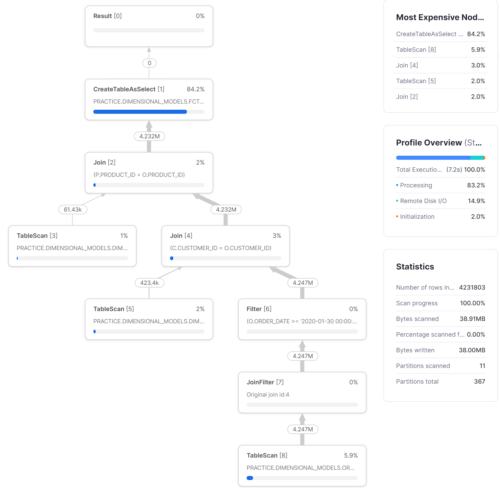
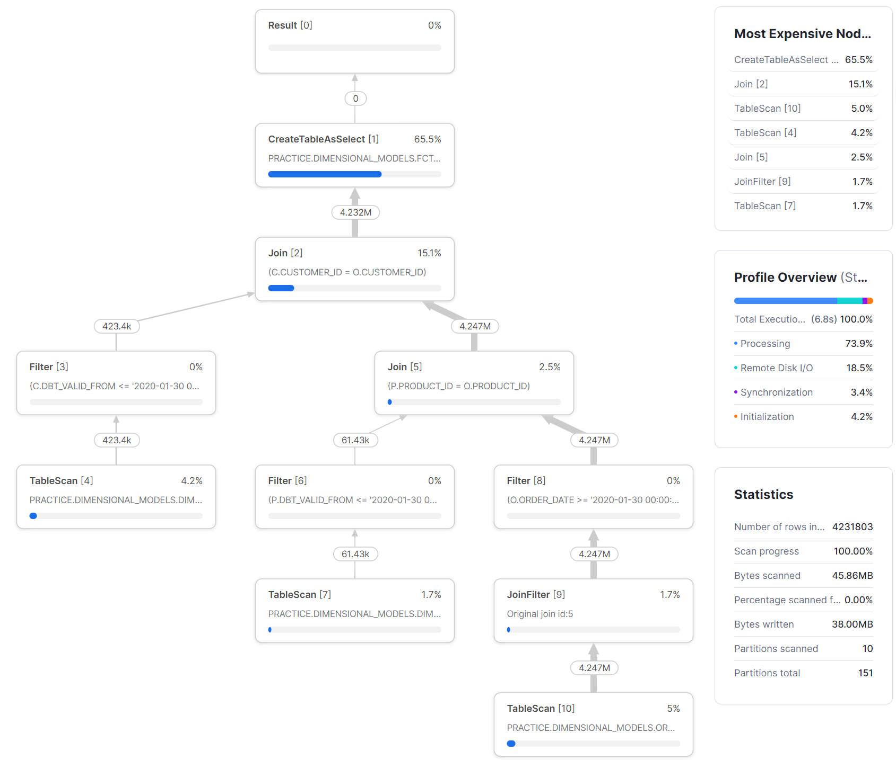

[![dbt-badge]][dbt-url] [![snowflake-badge]][snowflake-url]


Data modeling is crucial because it provides a structured framework for organizing and interpreting data. Slowly Changing Dimension (SCD) Type 2 is a popular method in data warehousing for managing and tracking historical data changes.

However, no single data modeling approach can solve all problems in the most efficient manner. It's essential to model data based on its characteristics, business requirements, and the technology stack in use.

With the rise of cloud data warehouses and the decreasing cost of storage, abandoning SCD in favor of daily snapshots for dimension tables could be more effective in certain scenarios.

To compare these approaches, we will create two `customer` dimension tables for the same dataset: one using SCD Type 2 and the other using daily snapshots. We will then benchmark and compare the performance and efficiency of both methods.

## Assumption
Daily snapshot of the transaction database table is exported to the data lake and available for OLAP workload.
## Set Up
- Snowflake is used as the compute engine.
- An extra small warehouse in Snowflake is used to execute the query.
- All queries are executed sequentially.
- dbt is used to managed the data transformation logic.

### Synthetic Data Generation

The dataset we will the following characteristics:
- Each customer can only have 1 entry per date.
- `customer_address` is the only attribute that can change.
- `updated_date` indicates the last modified date of the record.

```sql
CREATE DATABASE IF NOT EXISTS practice;

CREATE SCHEMA IF NOT EXISTS  practice.dimensional_models;

SET customer_sample_size = 1000000;

CREATE
OR REPLACE TEMPORARY TABLE customer_change AS WITH cte AS (
    SELECT
        UNIFORM(1, $customer_sample_size / 2, RANDOM(1)) :: INT AS customer_id,
        MD5(customer_id) AS customer_name,
        RANDSTR(
            UNIFORM(3, 20, RANDOM(4)),
            UNIFORM(5, $customer_sample_size * 4, RANDOM(6))
        ) AS customer_address,
        DATEADD(
            'day',
            FLOOR(UNIFORM(0, 30, RANDOM(7))),
            '2020-01-01'
        ) AS updated_date,
    FROM
        TABLE(GENERATOR(rowcount => $customer_sample_size)) qualify ROW_NUMBER() over (
            PARTITION BY customer_id,
            updated_date
            ORDER BY
                updated_date ASC
        ) = 1 -- one entry per customer per DAY
),
with_row_num AS (
    SELECT
        customer_id,
        customer_name,
        customer_address,
        first_value(updated_date) over(
            PARTITION by customer_id
            ORDER BY
                updated_date ASC
        ) AS registration_date,
        updated_date,
        ROW_NUMBER() over (
            PARTITION BY customer_id
            ORDER BY
                updated_date ASC
        ) AS row_num
    FROM
        cte
)
SELECT
    w1.customer_id,
    w1.customer_name,
    w1.customer_address,
    w1.registration_date,
    w1.updated_date
FROM
    with_row_num w1
    LEFT JOIN with_row_num w2 ON w1.customer_id = w2.customer_id
    AND w1.row_num = w2.row_num -1
WHERE
    w1.customer_address != w2.customer_address
    OR w2.customer_id IS NULL;

CREATE
OR REPLACE TABLE customer_stage AS WITH record_date AS (
    SELECT
        '2019-12-31' :: DATE + n AS record_date
    FROM
        (
            SELECT
                ROW_NUMBER() over(
                    ORDER BY
                        0
                ) n
            FROM
                TABLE(GENERATOR(rowcount => 31))
        )
)
SELECT
    *
FROM
    customer_change C
    JOIN record_date d ON C.updated_date <= d.record_date qualify ROW_NUMBER() over (
        PARTITION BY d.record_date,
        C.customer_id
        ORDER BY
            updated_date DESC
    ) = 1;
```

# Comparison
## Development
**Daily Dimension Snapshot**
```sql
{{
    config(
        materialized='incremental',
        unique_key=['customer_id', 'record_date']
    )
}}

select 
    {{ dbt_utils.generate_surrogate_key(['customer_id', 'record_date']) }} as customer_key,
    *
from {{ source('DIMENSIONAL_MODELS', 'CUSTOMER_STAGE')}}
where record_date >= '{{ var('start_date') }}'
    and record_date < '{{ var('end_date') }}'
```
**SCD Type 2**
```sql


{{
    config(
      target_database='practice',
      target_schema='dimensional_models',
      unique_key='customer_id',
      strategy='timestamp',
      updated_at='updated_date',
    )
}}

select
    {{ dbt_utils.generate_surrogate_key(['customer_id', 'record_date']) }} as customer_key,
    * 
from {{ source('DIMENSIONAL_MODELS', 'CUSTOMER_STAGE') }}
where record_date >= '{{ var('start_date') }}'
    and record_date < '{{ var('end_date') }}'


```
Since the complexity of building the dimensions are abstracted by dbt, the development effort for both approaches are fairly similar.

*Note: It is important to define an explicit timeframe in the dbt model, otherwise the operation can become non-idempotent.*

## Efficiency
**Storage**
```sql
SELECT
    table_catalog,
    table_schema,
    table_name,
    row_count/1000000 as row_count_million,
    bytes/1000000 as mb
FROM
    information_schema.tables
WHERE
    table_name in ('DIM_CUSTOMER_DAILY_SNAPSHOT', 'DIM_CUSTOMER_SCD');
```
| TABLE_NAME   | ROW_COUNT_MILLION    | SIZE   |
|-------------|-------------|-------------|
| DIM_CUSTOMER_DAILY_SNAPSHOT| 8.86 | 671.80 MB|
| DIM_CUSTOMER_SCD | 0.93| 63.11 MB|
| FCT_ORDER | 460| 2.2 GB|

The size of `DIM_CUSTOMER_SCD` is 10x compared to `DIM_CUSTOMER_DAILY_SNAPSHOT`. This is because an entry will be generated for a primary key regardless of whether the row has change or not. 


**Compute**
*Data Skipping*
One of the most common OLAP query is to calculate daily metrics, e.g. daily sales by customer. When constructing the fact table, we will need to apply a time constraint on both the dimension and fact table. The daily dimension snapshot requires an equality join and the SCD Type 2 dimension requires a range join.

Snowflake's `SYSTEM$CLUSTERING_INFORMATION` provides information about clustering information, including average clustering depth, for a table based on one or more columns in the table. This allows us to gauge wheter the table structure is efficient for the join.

```sql
-- Daily Snapshot
SELECT SYSTEM$CLUSTERING_INFORMATION('PRACTICE.DIMENSIONAL_MODELS.DIM_CUSTOMER_DAILY_SNAPSHOT', '(RECORD_DATE)');
```

```json
{'cluster_by_keys': 'LINEAR(RECORD_DATE)',
 'total_partition_count': 199,
 'total_constant_partition_count': 195,
 'average_overlaps': 0.0201,
 'average_depth': 1.0151,
 'partition_depth_histogram': {'00000': 0,
  '00001': 196,
  '00002': 3,
  '00003': 0,
  '00004': 0,
  '00005': 0,
  '00006': 0,
  '00007': 0,
  '00008': 0,
  '00009': 0,
  '00010': 0,
  '00011': 0,
  '00012': 0,
  '00013': 0,
  '00014': 0,
  '00015': 0,
  '00016': 0},
 'clustering_errors': []}
```
Snowflake uses micro-partitions to store underlying table data, and these micro-partitions are immutable, this means every write operation generates new micro-partitions. Because new data is written to the dimension table daily, all data within the same day sits within the same micro partition, this allows the query optimiser to skip the data files very efficiently. The `average_depth` is just 1.0151, which means when we constrain the timeframe of the daily snapshot dimension to a particular day, the optimiser only needs to open 1 micro partition, all the rest will be skipped.

```sql
-- SCD Type 2
SELECT SYSTEM$CLUSTERING_INFORMATION('PRACTICE.DIMENSIONAL_MODELS.DIM_CUSTOMER_SCD', '(DBT_VALID_FROM, DBT_VALID_TO)');
```
```json
{'cluster_by_keys': 'LINEAR(DBT_VALID_FROM, DBT_VALID_TO)',
 'total_partition_count': 6,
 'total_constant_partition_count': 0,
 'average_overlaps': 5.0,
 'average_depth': 6.0,
 'partition_depth_histogram': {
    '00000': 0,
    '00001': 0,
    '00002': 0,
    '00003': 0,
    '00004': 0,
    '00005': 0,
    '00006': 6,
    '00007': 0,
    '00008': 0,
    '00009': 0,
    '00010': 0,
    '00011': 0,
    '00012': 0,
    '00013': 0,
    '00014': 0,
    '00015': 0,
    '00016': 0},
 'clustering_errors': []}
```
Because Snowflake employs a `COPY ON WRITE` mecahnism, everytime a row in an SCD Type 2 dimension has changed, a previous micro partition will be invalidated and all the data that has not change will be copied to a new micro-partition alongside with the row that has changed. This results in high `average_depth` of SCD Type 2 tables.

*Query Execution Time*
Although there are a lot more rows in the daily dimension snapshot table, the processing time for constructing the dimension table is much shorter than the SCD Type 2 dimension. This is because building the daily dimension snapshot only requires `INSERT` operation, while SCD Type 2 requires `UPSERT` which invalidates existing micro partition and creates new ones.

**Fact Tabele Creation**

The execution times for both approaches are comparable. The daily dimension snapshot does not require filtering, as the data file can be efficiently skipped by the optimizer. The total bytes scanned were 38.91MB, which is 15% less than the 45.86MB scanned for the SCD Type 2 dimension. The number of partitions scanned was similar for both approaches (11 and 10).

The join operation between the customer dimension and the order fact table was proportionally more expensive for the SCD Type 2 approach. A possible reason for this is that the customer dimension becomes more fragmented after update operations, requiring shuffling.

*Daily Dimension Snapshot*
```sql
SELECT
    o.order_id,
    c.customer_key,
    p.product_key,
    o.quantity,
    o.order_date
FROM
    PRACTICE.DIMENSIONAL_MODELS.ORDER_STAGE o
    JOIN PRACTICE.DIMENSIONAL_MODELS.dim_customer_daily_snapshot c ON o.customer_id = c.customer_id
    AND c.record_date ='2020-01-30'
    JOIN PRACTICE.DIMENSIONAL_MODELS.dim_product_daily_snapshot p ON p.product_id = o.product_id
    AND p.record_date ='2020-01-30'
WHERE
    o.order_date >= '2020-01-30'
    AND o.order_date < '2020-01-31'
```


*SCD Type 2 Dimension*
```sql
SELECT
    o.order_id,
    c.customer_key,
    p.product_key,
    o.quantity,
    o.order_date
FROM
    PRACTICE.DIMENSIONAL_MODELS.ORDER_STAGE o
    JOIN PRACTICE.DIMENSIONAL_MODELS.dim_customer_scd c ON o.customer_id = c.customer_id
    AND c.dbt_valid_from  <= '2020-01-30'
    AND (c.dbt_valid_to > '2020-01-30' OR c.dbt_valid_to IS NULL)
    JOIN PRACTICE.DIMENSIONAL_MODELS.dim_product_scd p ON p.product_id = o.product_id
    AND p.dbt_valid_from  <= '2020-01-30'
    AND (p.dbt_valid_to > '2020-01-30' OR p.dbt_valid_to IS NULL)
WHERE
    o.order_date >= '2020-01-30'
    AND o.order_date < '2020-01-31'
```

## Maintenance
**Backfill**
Backfill is the process of filling in historical data that was previously missing or replacing outdated records with updated ones. This often becomes necessary when a data pipeline fails due to its inability to handle schema changes. Once the issue is resolved, a backfill job is needed to fill in the data gaps.


For the SCD Type 2 approach, we cannot simply re-run the new pipeline with specified start_date and end_date for the missing data. This is because dbt's snapshot is built sequentially, necessitating a separate backfill job or a complete re-run of the pipeline for all the days since the failure occurred.

In contrast, for the daily dimension snapshot approach, we can easily rerun the new pipeline for the days when the failure occurred as the dimensions are updated on the same cadence as the fact table.

# Discussion
For general use case, the query performance for both approaches is fairly similar. The daily snapshot approaches requires a lot more storage compared to SCD Type 2 dimension, but the extra storage is negligible compared to what the fact table requires, and storage is cheap, i.e. Snowflake charges $23/TB, making optimising storage a lower priority in this scenario. In terms of maintenance, the daily snapshot approach allows for straightforward backfilling. In contrast, the SCD Type 2 method requires either a complete refresh after a failure or the creation of a separate backfill job.

When the dimension table is significantly large, such as at the petabyte scale, storing daily snapshots can be prohibitively expensive. For instance, storing a 1 PB dimension table will cost $23,000 per month, not to mention the extra storage required for time-travel. These costs will continue to rise even if there are no changes to the underlying records. In such cases, it may be more efficient to reduce the size of the dimension table by using the SCD Type 2 approach.


[dbt-badge]: https://img.shields.io/badge/-dbt-1c2541?logo=dbt&logoColor=FF694B&style=for-the-badge
[dbt-url]: https://www.getdbt.com/

[snowflake-badge]: https://img.shields.io/badge/-snowflake-1c2541?logo=snowflake&logoColor=29B5E8&style=for-the-badge
[snowflake-url]: https://www.snowflake.com/